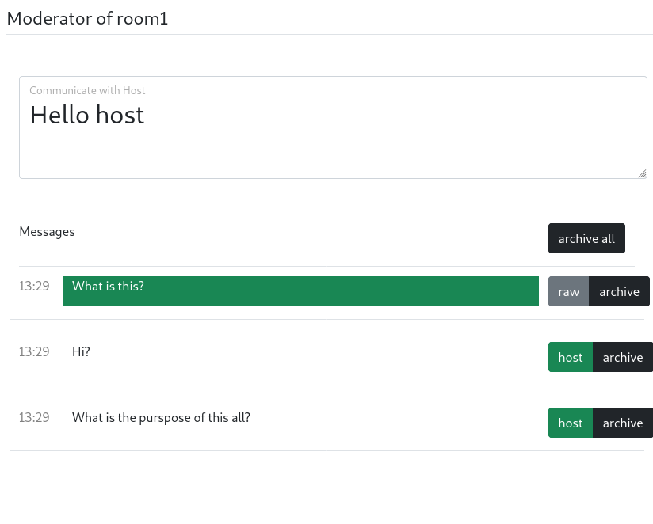

NdW Chat
========
A chat for the Night of Sciences Karlsruhe.

It consists of three parts:

Server
------
A server written in Python (see concepts below) that manages a JSON based database with messages.
Install the python package…

Viewer Client
-------------
Just a simple web interface to submit messages.

Client
------
See `frontend` folder.

### Moderator Client

### Host Client

YouTube Client
--------------
It lives in `youtube` and submits messages from the YouTube live stream chat.

## Basic Concepts

Outdated.

- there are three views (o ne per track)
  - moderator
    - reviews incoming questions (delete or pass to the moderator)
      - delete: archive directly
      - pass: pass the message to the moderator
      - both remove the message from the moderator view
    - can archive all current questions
      - usually when the room changes
      - can set the a specific text to notify the host
  - host
    - stands in front of the camera, nearby the speaker
      - can archive questions (removes from its view)
  - viewer
    - can just send messages
      - messages are truncated to 200 characters and sanitized
- authentication
  - basic: just a simple unhashed password
- every message has
  - id: number to identify the message
  - track: like room 1, room 2, …, one can subscribe to a room
  - state: archived, raw (directly from user, not seen at host view), visible (seen at host view)  
  - time: unix time in seconds when it has been send
  - content: content of the message
- commands
  - that the server supports
  - set state(id, new_state)
    - set the state of a specific message, the password is for authentication
    - set content(id, new_content)
      - …
    - set host text(track, text)
    - add message(content)
      - add the message truncated with state "raw"
    - get messages(track)
  - that the host view supports
    - set state(id, new_state)
    - set content(id, new_content)
    - set host text(track, text)
    - push message(id, track, state = visible, time, content)
  - that the moderator view supports
    - push message(id, track, state = raw, time, content)
  
  - the viewer view does not support any commands
- YouTube
  - messages from a chat of a youtube channel can be polled and inserted into the message queue

## Implementation Notes

- server
  - implemented in python with websockets
  - every actions leads to an emitting of messages
  - database
    - https://github.com/msiemens/tinydb
    - should be enough, its more for error recovery / persistance and not queried concurrently

## Usage

`NDW_HOME` is the folder that is used to store the config. The config file is generated by the first call of `ndw_chat_server`